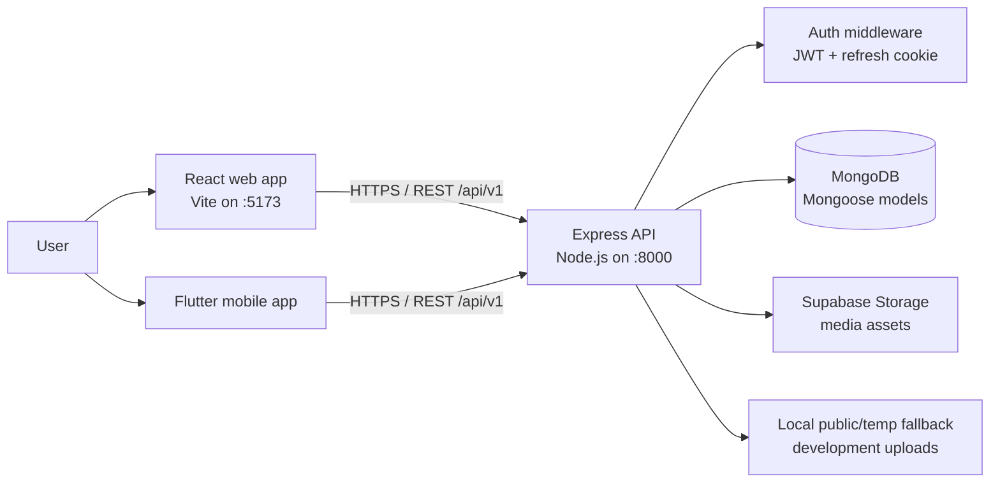

<div align="center">
  
  <h1>Lume</h1>
  <p><strong>A full-stack video platform for discovery, creators, and community.</strong></p>
  <p>
    <a href="#getting-started">Get started</a> | 
    <a href="#features">Features</a> | 
    <a href="#technology">Technology</a> | 
    <a href="#project-structure">Architecture</a>
  </p>
</div>

---

## Overview

Lume is a modern video-sharing application that brings together video discovery, creator tools, and community interaction in one responsive product experience. Users can explore and search for videos, engage through likes and comments, follow channels, publish community posts, manage their viewing activity, and keep a personal Watch Later collection.

The project is built as a monorepo with a React web client, Express API, MongoDB persistence, Supabase-backed media storage, and a Flutter mobile client source directory. It is a strong portfolio project for demonstrating end-to-end product thinking across frontend UX, REST APIs, authentication, data modeling, and media workflows.

## Features

### Viewer experience

- Browse, search, and watch published videos
- Like videos and comments
- Save or remove videos from a personal **Watch Later** list
- Review saved videos, liked videos, and watch history
- Switch between responsive desktop/mobile layouts and light/dark themes

### Community and creators

- Register, sign in, and manage a profile
- Subscribe to channels and view subscription-based content
- Upload and manage channel videos
- Create community posts, reply to discussions, and report content
- Receive and manage in-app notifications
- Access creator dashboard and account settings

### Platform foundations

- JWT-based access authentication with refresh tokens stored in HTTP-only cookies
- Secure password hashing with bcrypt
- MongoDB/Mongoose data layer and paginated data patterns
- Supabase integration for uploaded media
- Centralized API errors and response utilities
- File upload handling through Multer

## Full technology stack

| Area | Technology | How it is used |
| --- | --- | --- |
| Web application | React 18 | Component-based single-page user interface |
| Web build system | Vite 5 | Fast local development server and optimized production bundling |
| Web routing | React Router 6 | Client-side protected routes, public pages, and feature navigation |
| Client data layer | Axios | REST API client with request interceptors and credential support |
| UI and motion | CSS design tokens, Framer Motion, Lucide React | Responsive visual system, transitions, and iconography |
| API runtime | Node.js | JavaScript server runtime |
| API framework | Express 5 | REST endpoints, middleware, routing, and static-file delivery |
| Database | MongoDB | Persistent storage for users, videos, engagement, and community data |
| Object modeling | Mongoose | Schemas, validation, relationships, and MongoDB access |
| Authentication | JSON Web Tokens and cookie-parser | Access-token authorization and refresh-token cookie sessions |
| Password security | bcrypt | Secure password hashing before persistence |
| Upload handling | Multer | Multipart uploads for videos, thumbnails, avatars, and post images |
| Media storage | Supabase Storage | Hosted video/image uploads and public media URLs |
| API resilience | Custom `ApiError`, `ApiResponse`, and `asyncHandler` utilities | Consistent error responses and asynchronous route handling |
| Mobile client | Flutter and Dart | Native Android/iOS client source with repositories, Cubits, and feature screens |
| Mobile state management | flutter_bloc / Cubit | Predictable mobile feature state and UI updates |
| Local developer tooling | npm, Nodemon, Concurrently | Dependency management, server reloads, and parallel services |

## System architecture



### Backend architecture

The API follows a feature-first modular structure. Each product area owns its route definitions, controller logic, and Mongoose model; reusable middleware and utilities live in `backend/src/shared`.

```text
HTTP request
  -> Express application and global middleware
  -> Feature route
  -> Authentication middleware (where required)
  -> Controller / business logic
  -> Mongoose model and MongoDB, or Supabase media storage
  -> Standardized JSON response
```

| Module | Responsibility |
| --- | --- |
| `auth` | Registration, login, logout, sessions, profiles, avatar updates, history |
| `videos` | Discovery, search, viewing, upload, publishing, deletion, view tracking |
| `comments` | Video conversations and comment retrieval/creation |
| `likes` | Likes for videos, comments, and community posts |
| `community` | Community posts, replies, images, and reporting workflows |
| `subscriptions` | Channel follow/unfollow and subscribed-channel data |
| `saved-videos` | Personal Watch Later collection |
| `notifications` | In-app notification retrieval and read state |
| `users` | Creator dashboard statistics and channel video management |

### Frontend architecture

The React client groups screens and components by product feature. Cross-cutting concerns are isolated in `shared` so that layout, auth state, themes, API access, and visual primitives are reusable.

```text
frontend/src/
|-- features/       # Pages and components grouped by product capability
|-- shared/
|   |-- components/ # Navbar, sidebar, bottom navigation, loading/empty states
|   |-- context/    # Authentication and visual theme state
|   |-- hooks/      # Reusable API and UI behavior hooks
|   `-- services/   # HTTP client and API calls
|-- services/       # Web-facing API integration
`-- styles/         # Reset, design tokens, layouts, utilities, animations
```

## How Lume works

### 1. Visitor and authentication flow

1. A visitor opens the React application and can enter a limited demo experience.
2. Sign-in and registration requests are sent to `/api/v1/users`.
3. The backend hashes passwords with bcrypt, validates credentials, and returns an access token while setting a refresh-token cookie.
4. The web client stores the active user and access token locally, then Axios attaches the bearer token to subsequent authenticated calls.
5. On app load, the authentication context calls the current-user endpoint to verify the session before protected pages are rendered.

### 2. Video discovery and playback flow

1. The Home and Search pages request paginated video data from the videos API.
2. Selecting a video opens its player route at `/watch/:videoId`.
3. The player loads video metadata, increments the view count, loads comments, and exposes like/save actions for authenticated users.
4. Watch history is associated with the viewer account and can be revisited from the library experience.

### 3. Creator upload flow

1. An authenticated creator selects a video file and optional thumbnail in the upload UI.
2. The client submits multipart form data to the videos API.
3. Multer receives the files; the backend uploads eligible media to Supabase Storage and stores the resulting URLs with video metadata in MongoDB.
4. If Supabase is not configured during local development, the backend safely falls back to serving the temporary upload from its static public directory.
5. The uploaded video becomes available through the creator dashboard and the discovery experience according to its publish state.

### 4. Community and engagement flow

1. Users can publish community posts, add replies, and report content.
2. Likes are modeled independently so the same engagement pattern supports videos, comments, and posts.
3. Subscribing to a channel updates the subscription data and feeds the subscriptions experience.
4. Watch Later actions add or remove a video from the signed-in user's saved collection; `/saved` displays the resulting library.

## Core data model

| Entity | Key relationships and purpose |
| --- | --- |
| User | Owns a channel, profile, authentication state, watch history, and creator settings |
| Video | Belongs to an owner/channel; stores media URLs, metadata, publication state, and view count |
| Comment | Belongs to a video and author; supports viewer discussion |
| Like | Associates a user with a video, comment, or community post engagement action |
| Tweet / community post | Belongs to a user; supports content, media, replies, and likes |
| Subscription | Connects a subscriber to a creator channel |
| Saved video | Connects a user to a Watch Later video entry |
| Notification | Records user-facing activity and read state |

## Project structure

```text
Lume/
|-- frontend/                 # React + Vite single-page application
|   `-- src/
|       |-- features/         # Auth, videos, community, dashboard, channels
|       `-- shared/           # Shared UI, contexts, hooks, utilities
|-- backend/                  # Express REST API
|   |-- src/
|   |   |-- features/         # API modules by product domain
|   |   |-- shared/           # Middleware, errors, database and utility code
|   |   |-- app.js            # Express configuration and route registration
|   |   `-- index.js          # Server entry point
|   |-- public/               # Public/static assets and temporary uploads
|   `-- .env.sample           # Environment variable template
|-- lume_app/                 # Flutter mobile application source
`-- package.json              # Root development scripts
```

## Getting started

Follow these steps to run Lume locally.

### 1. Prerequisites

Install or prepare the following before continuing:

- [Node.js](https://nodejs.org/) 18+ (the current LTS release is recommended)
- npm 9+ (included with Node.js)
- A MongoDB database, either local MongoDB or [MongoDB Atlas](https://www.mongodb.com/atlas)
- A [Supabase](https://supabase.com/) project and storage configuration for media uploads
- Git, if you are cloning from a remote repository

### 2. Clone the repository

```bash
git clone <repository-url>
cd Lume
```

If you already have the project locally, open a terminal in the repository root instead.

### 3. Install dependencies

Run the root setup script once. It installs the backend and frontend dependencies.

```bash
npm run setup
```

### 4. Configure environment variables

Create a backend environment file from the provided template.

**Windows PowerShell**

```powershell
Copy-Item backend/.env.sample backend/.env
```

**macOS / Linux**

```bash
cp backend/.env.sample backend/.env
```

Open `backend/.env` and provide valid values:

```env
PORT=8000
MONGODB_URI=mongodb+srv://<username>:<password>@<cluster>/<database>
CORS_ORIGIN=http://localhost:5173

ACCESS_TOKEN_SECRET=<generate-a-long-random-secret>
ACCESS_TOKEN_EXPIRY=1d
REFRESH_TOKEN_SECRET=<generate-a-different-long-random-secret>
REFRESH_TOKEN_EXPIRY=10d

SUPABASE_URL=https://<project-ref>.supabase.co
SUPABASE_ANON_KEY=<your-supabase-anon-key>
```

> Never commit `backend/.env`. It contains credentials and is intentionally excluded from source control.

### 5. Start the application

From the repository root, run:

```bash
npm run dev
```

This launches both services concurrently:

| Service | Address | Purpose |
| --- | --- | --- |
| Frontend | `http://localhost:5173` | React web application |
| Backend | `http://localhost:8000` | Express REST API |

Open `http://localhost:5173` in your browser. During development, Vite forwards `/api` requests to the backend automatically.

### Run services individually

Use separate terminals when you want to focus on one service:

```bash
# Backend only, with automatic reloads
npm run backend

# Frontend only
npm run frontend
```

## Available commands

| Command | Description |
| --- | --- |
| `npm run setup` | Install frontend and backend dependencies |
| `npm run dev` | Start frontend and backend together |
| `npm run frontend` | Start only the Vite development server |
| `npm run backend` | Start only the Express server through Nodemon |
| `npm --prefix frontend run build` | Create an optimized frontend production build |
| `npm --prefix frontend run preview` | Preview the built frontend locally |

## Production build checklist

Before deployment, validate the frontend build locally:

```bash
npm --prefix frontend run build
npm --prefix frontend run preview
```

For a production environment, set secure, environment-specific values for `MONGODB_URI`, both JWT secrets, `SUPABASE_URL`, and `SUPABASE_ANON_KEY`. Configure the deployed frontend origin in your CORS policy and serve the API over HTTPS so authentication cookies remain protected in transit.

## API domains

The API is organized by product domain under `/api/v1`:

| Domain | Base path |
| --- | --- |
| Authentication and user profiles | `/users` |
| Videos | `/videos` |
| Comments | `/comments` |
| Likes | `/likes` |
| Community posts | `/tweets` |
| Channel subscriptions | `/subscriptions` |
| Dashboard | `/dashboard` |
| Notifications | `/notifications` |
| Watch Later | `/saved-videos` |

Authenticated Watch Later endpoints include:

```text
GET   /api/v1/saved-videos
PATCH /api/v1/saved-videos/:videoId
```

## Contributing

Contributions and product improvements are welcome.

1. Fork the repository and create a feature branch.
2. Keep changes focused and follow the existing feature-based structure.
3. Run `npm --prefix frontend run build` before submitting a pull request.
4. Describe the user impact and testing completed in the pull request.

## License

Distributed under the ISC License.
